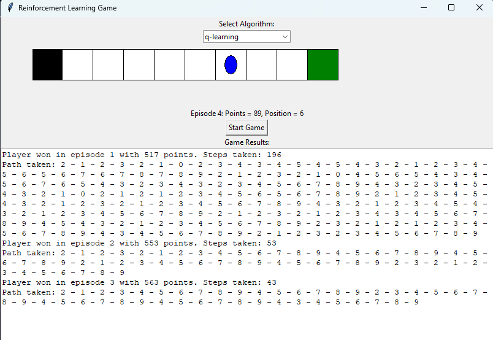

# GaIB-Reinforcement-Learning-Game

This repository contains the submission for the Lab Assistant Selection for the Lab Grafika dan Inteligensi Buatan at ITB. It features a reinforcement learning project implemented in Python, focusing on two algorithms: Q-Learning and SARSA. These algorithms are applied to a simple 1D game where the player must navigate to collect an apple while avoiding a hole. The game is visualized with a graphical user interface (GUI) built using Tkinter, allowing users to choose between the two algorithms and observe the learning process in real time.

## Table of Contents
- [Description](#description)
- [Usage](#usage)
- [Program Display](#program-display)
- [Requirements](#requirements)
- [Algorithms Implemented](#algorithms-implemented)
- [Project Structure](#project-structure)
- [Author Information](#author-information)

## Description

In this project, a reinforcement learning agent is trained to play a game with the following rules:
- The player is placed on a 1D board of 10 positions.
- There is a hole at position 0 and an apple at position 9.
- The player starts at position 2 and must move left or right to collect the apple without falling into the hole.
- Falling into the hole results in a penalty of -100 points, while collecting the apple rewards +100 points.
- Each step that does not result in a win or loss deducts 1 point.
- The agent wins after reaching +500 points or loses after dropping to -200 points.
The project implements both Q-Learning and SARSA algorithms from scratch, allowing the user to choose the algorithm via a dropdown in the GUI.

## Usage
To run the game with a graphical user interface (GUI), execute the following command:
```bash
python src/main.py
```

To run the game in the command-line interface (CLI), execute the following command:
```bash
python src/main_cli.py
```

## Program Display




## Requirements

- Python 3.x
- Libraries:
  - `tkinter`
  - `numpy`
  - `time`

## Algorithms Implemented

✅ Q-Learning

✅ SARSA

## Project Structure
```bash
.
├── answers
│   ├── reinforcement-learning.pdf
├── src
│   ├── main.py
│   ├── main_cli.py
│   ├── rl_agent.py
├── .gitignore
├── README.md
```

## Author Information
- Name: Novelya Putri Ramadhani
- NIM: 13522096